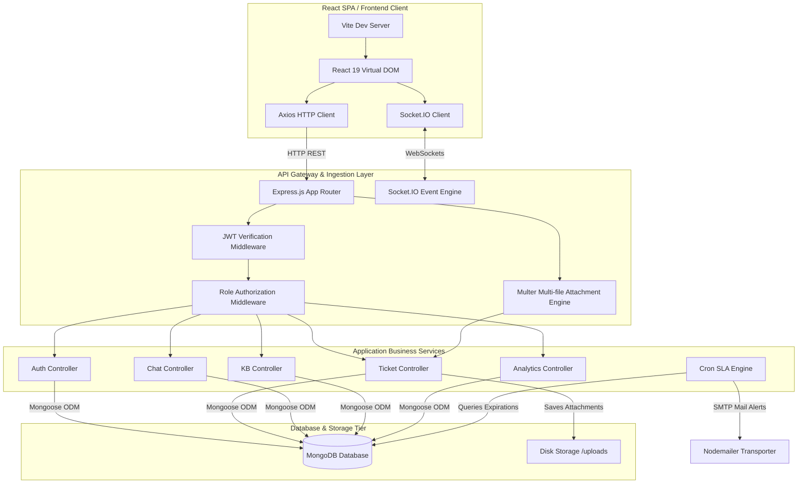
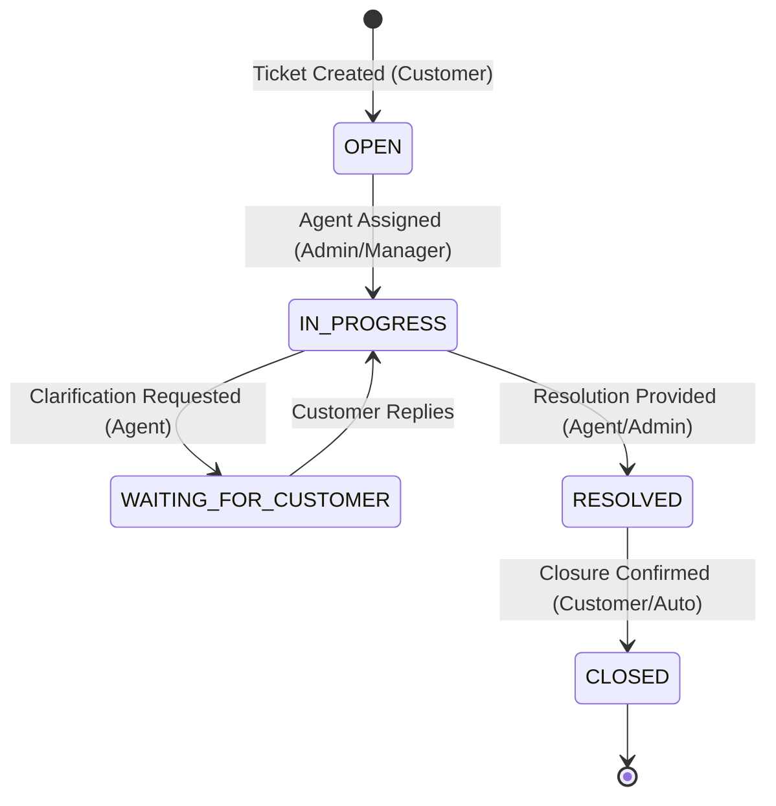

<p align="center">
  
</p>

<p align="center">
  <a href="#-system-architecture"></a>
  <a href="#-database-specification"></a>
  <a href="#-api-gateway-specification"></a>
  <a href="#-role-based-authorization"></a>
</p>

<p align="center">
  
  
  
  
  
  
  
</p>

---

## 📋 Table of Contents

- [🌟 System Overview](#-system-overview)
- [🏗️ System Architecture](#️-system-architecture)
- [⚙️ Technical Specifications & Workflows](#️-technical-specifications--workflows)
  - [1. Ticket Lifecycle & State Transition](#1-ticket-lifecycle--state-transition)
  - [2. Dynamic SLA Deadline Calculation](#2-dynamic-sla-deadline-calculation)
  - [3. SLA Monitoring & Background Cron Jobs](#3-sla-monitoring--background-cron-jobs)
  - [4. Real-time Communication Topology](#4-real-time-communication-topology)
- [🗄️ Database Specification (Mongoose schemas)](#️-database-specification-mongoose-schemas)
- [🔌 API Gateway Specification](#-api-gateway-specification)
- [👥 Role-based Access Control (RBAC) Matrix](#-role-based-access-control-rbac-matrix)
- [📁 Folder Structure Blueprint](#-folder-structure-blueprint)
- [🚀 Local Bootstrapping & Setup](#-local-bootstrapping--setup)
- [🛡️ Security Implementation Architecture](#️-security-implementation-architecture)

---

## 🌟 System Overview

**IBM HelpDesk** is a production-ready, enterprise-grade **support ticket management platform**. It allows organizations to manage client inquiries via automated routing, SLA compliance tracking, integrated knowledge repositories, and role-based administrative consoles.

The platform provides dedicated workspaces for **five user roles** (`CUSTOMER`, `AGENT`, `MANAGER`, `ADMIN`, `SUPER_ADMIN`), with responsive layouts, real-time ticket messaging, interactive statistics, and automatic email notifications triggered by SLA breach daemons.

---

## 🏗️ System Architecture

The project is designed as a **decoupled Client-Server model** utilizing the MERN stack (MongoDB, Express, React, Node.js). 



---

## ⚙️ Technical Specifications & Workflows

### 1. Ticket Lifecycle & State Transition
Tickets undergo structured transitions to ensure traceablity. Status updates are audited in the database:



### 2. Dynamic SLA Deadline Calculation
When a customer submits a ticket, the backend calculates the resolution deadline (`slaDeadline`) using the current timestamp and a configuration matrix keyed by `priority`:

```
SLA Deadline = Creation Timestamp + (SLA Hours * 3600000 ms)
```

| Priority | SLA Resolution Target | Escalation Rules |
| :--- | :--- | :--- |
| `URGENT` | **4 Hours** | Immediate escalation alerts to Admins & Managers. |
| `HIGH` | **24 Hours** | High-priority warnings. |
| `MEDIUM` | **48 Hours** | Standard queue resolution. |
| `LOW` | **72 Hours** | Extended resolution buffer. |

### 3. SLA Monitoring & Background Cron Jobs
The system implements automated background tracking using **Node-Cron**:

1. **Hourly Check Job (`slaChecker.js`)**:
   * Runs hourly: `0 * * * *`
   * Scans MongoDB for tickets that are not `RESOLVED` or `CLOSED`, where `slaDeadline` is less than `Date.now()`, and `isSlaBreached` is `false`.
   * Flags the ticket as breached (`isSlaBreached = true`) and triggers high-priority email alerts to all `ADMIN`, `SUPER_ADMIN`, and `MANAGER` accounts via Nodemailer, as well as to the assigned support agent.
2. **Interval check job (`slaJob.js`)**:
   * Runs every 5 minutes: `*/5 * * * *`
   * Performs quick sweeps of un-resolved expired tickets to alert assigned support agents.

### 4. Real-time Communication Topology
* **Channel**: WebSockets powered by **Socket.IO (4.x)** configured with CORS validation (`http://localhost:5173`).
* **Session Handshake**: Auto-reconnect limits (up to 5 retries, timeout of 2000ms) are configured on the client.
* **Room-based Partitioning**: Support requests join a dedicated room mapped to the ticket's MongoDB `ObjectId` (`joinRoom` and `leaveRoom` events). Real-time message exchanges are scoped to the room.

---

## 🗄️ Database Specification (Mongoose schemas)

### Entity Relationship Diagram
```
  ┌─────────────────┐             ┌─────────────────┐             ┌─────────────────┐
  │      User       │             │     Ticket      │             │  Conversation   │
  ├─────────────────┤             ├─────────────────┤             ├─────────────────┤
  │ _id (PK)        │1 ◄─────────*│ createdBy (FK)  │1 ◄─────────*│ ticket (FK)     │
  │ email (Unique)  │             │ assignedTo (FK) │             │ sender (FK)     │
  │ role (Enum)     │             │ messages (Sub)  │             │ isInternal      │
  └─────────────────┘             └─────────────────┘             └─────────────────┘
           1                              1                                
           │                              │                                
           │                              │                                
           ▼ *                            ▼ *                              
  ┌─────────────────┐             ┌─────────────────┐                              
  │  AuditLog       │             │   Article       │                              
  ├─────────────────┤             ├─────────────────┤                              
  │ user (FK)       │             │ author (FK)     │                              
  │ action          │             │ category (Text) │                              
  │ details         │             │ tags (Text idx) │                              
  └─────────────────┘             └─────────────────┘                              
```

### 1. User Schema (`User.js`)
Manages identities, cryptographic passwords, role privileges, and departments.
* **Indexes**: `{ email: 1 }` (Unique)

| Property | Type | Validation / Defaults | Description |
| :--- | :--- | :--- | :--- |
| `_id` | ObjectId | Auto-generated | Primary Key. |
| `name` | String | `required: true, trim: true` | Full name. |
| `email` | String | `required: true, unique: true, lowercase: true, trim: true` | Login credential. |
| `password` | String | `required: true, minlength: 6, select: false` | Hashed credential (excluded from standard fetches). |
| `role` | String | `enum: ["SUPER_ADMIN", "ADMIN", "AGENT", "CUSTOMER", "MANAGER"], default: "CUSTOMER"` | Role for authorization. |
| `department`| String | `default: "General", trim: true` | Operational department. |
| `isActive` | Boolean | `default: true` | Active state of user. |
| `createdAt` | Date | Auto-managed (timestamp) | Date of account creation. |

### 2. Ticket Schema (`Ticket.js`)
Tracks support requests, priority calculations, assigned agents, and attachments.
* **Indexes**: `{ createdBy: 1 }`, `{ assignedTo: 1 }`, `{ slaDeadline: 1 }`

| Property | Type | Validation / Defaults | Description |
| :--- | :--- | :--- | :--- |
| `subject` | String | `required: true, trim: true` | Request title. |
| `description`| String | `required: true, trim: true` | Detailed problem description. |
| `priority` | String | `enum: ["LOW", "MEDIUM", "HIGH", "URGENT"], default: "LOW"` | Calculated priority. |
| `status` | String | `enum: ["OPEN", "IN_PROGRESS", "WAITING_FOR_CUSTOMER", "RESOLVED", "CLOSED"], default: "OPEN"` | Ticket status. |
| `createdBy` | ObjectId | `ref: "User", required: true` | Ticket owner. |
| `assignedTo` | ObjectId | `ref: "User", default: null` | Support agent assigned. |
| `slaDeadline`| Date | Calculated pre-save | SLA Resolution target deadline. |
| `isSlaBreached`| Boolean| `default: false` | True if SLA target was missed. |
| `department` | String | `default: "General", trim: true` | Routed support department. |
| `attachments`| Array | Subdocuments: `[{ url, filename, uploadedAt }]` | Uploaded attachments (Max 5). |

### 3. Conversation Schema (`Conversation.js`)
Stores chat history for the ticket chat boxes.
* **Indexes**: `{ ticket: 1, createdAt: 1 }`

| Property | Type | Validation / Defaults | Description |
| :--- | :--- | :--- | :--- |
| `ticket` | ObjectId | `ref: "Ticket", required: true` | Parent ticket reference. |
| `sender` | ObjectId | `ref: "User", required: true` | Message author. |
| `message` | String | `required: true, trim: true` | Message body. |
| `isInternal` | Boolean | `default: false` | True for agent-only notes. |
| `createdAt` | Date | Auto-managed (timestamp) | Timestamp of message. |

### 4. Article Schema (`Article.js`)
Houses knowledge base entries.
* **Indexes**: Full-text index: `articleSchema.index({ title: "text", content: "text", tags: "text" })`

| Property | Type | Validation / Defaults | Description |
| :--- | :--- | :--- | :--- |
| `title` | String | `required: true, trim: true` | Article title. |
| `content` | String | `required: true` | Article markdown/text content. |
| `category` | String | `enum: ["General", "Technical", "Billing", "Account", "Software", "Hardware"], default: "General"` | Category grouping. |
| `tags` | Array | `[String]` | Searchable keywords. |
| `author` | ObjectId | `ref: "User", required: true` | Author user profile. |
| `isPublic` | Boolean | `default: true` | Visibility setting. |
| `views` | Number | `default: 0` | View count. |

### 5. AuditLog Schema (`AuditLog.js`)
Maintains an audit trail of user actions.
* **Indexes**: `{ user: 1 }`, `{ timestamp: -1 }`

| Property | Type | Validation / Defaults | Description |
| :--- | :--- | :--- | :--- |
| `user` | ObjectId | `ref: "User", required: true` | Performed by user. |
| `action` | String | `enum: ["LOGIN", "LOGOUT", "CREATE_USER", "UPDATE_USER", "DELETE_USER", "RESET_PASSWORD", "CREATE_TICKET", "UPDATE_TICKET", "ASSIGN_TICKET", "FILE_UPLOAD"]` | Event label. |
| `details` | String | `required: true` | Description of changes. |
| `ipAddress` | String | Captured from `req.ip` | Request source IP. |
| `userAgent` | String | Captured from headers | Request user-agent. |
| `timestamp` | Date | `default: Date.now` | Event timestamp. |

---

## 🔌 API Gateway Specification

All payloads expect JSON (`application/json`) unless processing file uploads (`multipart/form-data`). Protected endpoints require an `Authorization` header with a valid JWT token: `Bearer <token>`.

### Authentication Endpoints
* **`POST /api/auth/register`** - Registers a new user.
  * **Request Body**: `{ "name": "Name", "email": "user@test.com", "password": "securepassword", "role": "CUSTOMER" }`
  * **Response (201)**: `{ "message": "User registered", "token": "JWT", "id": "UID", "role": "CUSTOMER" }`
* **`POST /api/auth/login`** - Authenticates credentials.
  * **Request Body**: `{ "email": "user@test.com", "password": "securepassword" }`
  * **Response (200)**: `{ "message": "Login successful", "token": "JWT", "id": "UID", "role": "CUSTOMER" }`

### Ticket Management
* **`POST /api/tickets`** (Role: `CUSTOMER` | `multipart/form-data`) - Submits a ticket with up to 5 attachments.
  * **Payload**: Form-data with keys `subject`, `description`, `priority`, `department`, and file attachments named `attachments`.
* **`GET /api/tickets`** (Role: `ANY`) - Retrieves tickets based on user role (Customers see their own, Agents see assigned/unassigned, Admins/Managers see all).
* **`PUT /api/tickets/:id/status`** (Role: `AGENT`, `MANAGER`, `ADMIN`) - Updates a ticket's status.
  * **Request Body**: `{ "status": "IN_PROGRESS" }`
* **`PUT /api/tickets/:id/assign`** (Role: `MANAGER`, `ADMIN`) - Assigns a ticket to an agent.
  * **Request Body**: `{ "agentId": "AGENT_MONGO_ID" }`

### Knowledge Base Articles
* **`GET /api/articles`** (Public) - Searches and filters articles.
  * **Query Params**: `?search=query`, `?category=Technical`
* **`POST /api/articles`** (Role: `AGENT`, `MANAGER`, `ADMIN`) - Creates a new article.
  * **Request Body**: `{ "title": "Title", "content": "body", "category": "Technical", "tags": ["tag1"] }`

### Real-Time Chat & Communications
* **`GET /api/conversations/:ticketId`** (Role: `ANY`) - Retrieves chat logs.
* **`POST /api/conversations/:ticketId`** (Role: `ANY`) - Appends message.
  * **Request Body**: `{ "message": "hi", "isInternal": false }`

---

## 👥 Role-based Access Control (RBAC) Matrix

| Endpoint | Guest | Customer | Agent | Manager | Admin / Super Admin |
| :--- | :---: | :---: | :---: | :---: | :---: |
| `POST /api/auth/register` | ✅ | ✅ | ✅ | ✅ | ✅ |
| `POST /api/auth/login` | ✅ | ✅ | ✅ | ✅ | ✅ |
| `POST /api/tickets` | ❌ | ✅ | ❌ | ❌ | ❌ |
| `GET /api/tickets` | ❌ | ✅ *(Own)* | ✅ *(Dept)* | ✅ *(All)* | ✅ *(All)* |
| `PUT /api/tickets/:id/status`| ❌ | ❌ | ✅ | ✅ | ✅ |
| `PUT /api/tickets/:id/assign`| ❌ | ❌ | ❌ | ✅ | ✅ |
| `GET /api/articles` | ✅ | ✅ | ✅ | ✅ | ✅ |
| `POST /api/articles` | ❌ | ❌ | ✅ | ✅ | ✅ |
| `GET /api/analytics` | ❌ | ❌ | ❌ | ✅ | ✅ |

---

## 📁 Folder Structure Blueprint

```
IBM-HELPDESK/
│
├── backend/
│   ├── uploads/             # Disk storage location for uploaded attachments
│   └── src/
│       ├── app.js           # Express app instance, mounting middleware & routes
│       ├── server.js        # Server listener and Socket.IO initialization
│       ├── config/
│       │   └── db.js        # MongoDB database configuration pool
│       ├── controllers/
│       │   ├── analyticsController.js   # Analytics aggregations
│       │   ├── articleController.js     # KB publishing controller
│       │   ├── authController.js        # Authentication functions
│       │   ├── conversationController.js# Thread message handler
│       │   └── ticketController.js      # Ticket lifecycle controller
│       ├── jobs/
│       │   ├── slaChecker.js            # Hourly SLA cron checking daemon
│       │   └── slaJob.js                # 5-minute interval alert daemon
│       ├── middleware/
│       │   ├── authMiddleware.js        # Route verification and RBAC
│       │   └── uploadMiddleware.js      # Multer storage configuration
│       ├── models/                      # Database models
│       └── routes/                      # API endpoint routes
│
└── frontend/
    └── src/
        ├── socket.js        # Socket client configuration (timeout, reconnection)
        ├── api.js           # Centralized Axios client instance
        ├── pages/           # Dashboard views and layout routes
        ├── components/
        │   ├── ChatBox.jsx  # Socket lifecycle component for ticket messaging
        │   └── Navbar.jsx   # Top navigation menu bar
        └── App.jsx          # Declarative client-side routing & entry setup
```

---

## 🚀 Local Bootstrapping & Setup

### 1. Database Configuration
Ensure MongoDB is running locally on your default port:
```bash
mongod --dbpath /your/db/path
```
Or configure a connection URI on MongoDB Atlas.

### 2. Environment Variables (`backend/.env`)
Create a `.env` file in the `backend/` directory:
```env
PORT=5000
MONGO_URI=mongodb://127.0.0.1:27017/ibm_helpdesk
JWT_SECRET=your_jwt_signing_secret_here
```

### 3. Server Startup
Open a terminal in `/backend`, install dependencies, and start the development server:
```bash
cd backend
npm install
npm run dev
```
*The server will print:* `🚀 Server running on port 5000` and `✅ MongoDB Connected`.

### 4. Client Startup
Open a separate terminal in `/frontend`, install dependencies, and start the Vite development server:
```bash
cd frontend
npm install
npm run dev
```
* Navigate your browser to `http://localhost:5173`.

---

## 🛡️ Security Implementation Architecture

1. **Cryptographic Signatures (JWT)**: JSON Web Tokens use HMAC SHA-256 signatures to authorize API requests securely.
2. **Password Hashing**: User credentials undergo 10-round salted Bcrypt hashing before saving to the database.
3. **Mimetype Verification**: The `uploadMiddleware.js` uses Multer to validate and filter attachments, rejecting non-supported file formats (only allowing PDFs and standard image types).
4. **Data Isolation**: Database query layers ensure that normal users cannot fetch audit logs, analytics, or other users' tickets.
