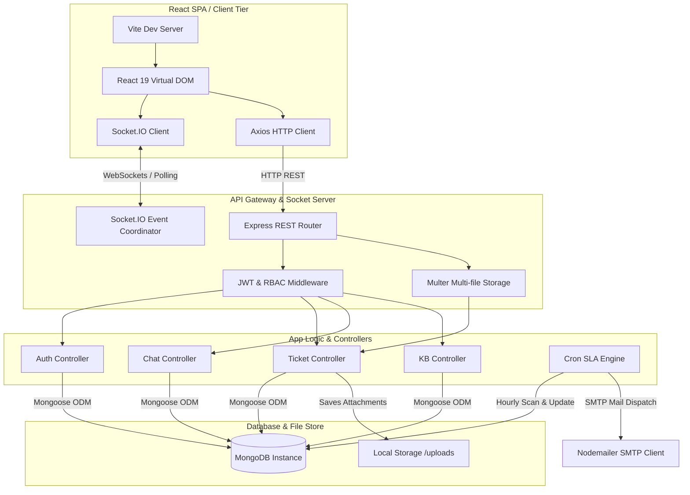

<p align="center">
  
</p>

<p align="center">
  <a href="#-system-architecture"></a>
  <a href="#-database-specification"></a>
  <a href="#-api-gateway-specification"></a>
</p>

<p align="center">
  
  
  
  
  
  
</p>

---

## 📋 Table of Contents

- [🏢 Architecture Topology](#-architecture-topology)
- [⚙️ Micro-Architectural Workflows](#️-micro-architectural-workflows)
  - [1. Authentication & Session Lifecycles](#1-authentication--session-lifecycles)
  - [2. Ticket Ingestion & Routing Pipelines](#2-ticket-ingestion--routing-pipelines)
  - [3. SLA Monitoring Daemon & Escalation Engine](#3-sla-monitoring-daemon--escalation-engine)
  - [4. Real-time Communication Topology](#4-real-time-communication-topology)
- [🗄️ Database Specification](#️-database-specification)
  - [Entity Relationship Mappings](#entity-relationship-mappings)
  - [Model Schemas](#model-schemas)
- [🔌 API Gateway Specification](#-api-gateway-specification)
- [📁 Repository Blueprint](#-repository-blueprint)
- [🚀 Infrastructure Bootstrapping](#-infrastructure-bootstrapping)
- [🛡️ Security Architecture](#️-security-architecture)

---

## 🏢 Architecture Topology

The application implements a decoupled client-server architecture consisting of an **Express.js API Gateway** (managing authentication, persistence, routing, and background services) and a **React 19 single-page application (SPA)** (providing role-based dashboards). 



---

## ⚙️ Micro-Architectural Workflows

### 1. Authentication & Session Lifecycles
* **Security Flow**: High-security user authorization is built using **JSON Web Tokens (JWT)**.
* **Password Security**: Credentials undergo 10-round salted **Bcrypt** hashing pre-save inside the user document database lifecycle hooks.
* **Route Protection Middleware**: Custom `protect` and `authorizeRoles` middlewares extract the Bearer Token from HTTP request headers, verify signatures via symmetric keys, check the `isActive` state of the account, and selectively route access.

```
Incoming Request -> [Bearer Token Header] -> Protect Middleware -> Verify Signature (JWT) -> Populates req.user -> Role Check (RBAC Middleware) -> Controller Action
```

### 2. Ticket Ingestion & Routing Pipelines
* **Ingestion**: Customers create tickets specifying details, target department (`IT`, `HR`, `BILLING`, `GENERAL`), and optional attachments.
* **Attachment Engine**: Processed via `multer` multi-disk storage middleware, limiting submissions to 5 files per payload. Files are renamed using unique UUID timestamps to prevent collision and saved inside `/uploads`.
* **SLA Time Calculation**: When a ticket is created, the system calculates an automated `slaDeadline` based on the ticket's severity:
  * `URGENT`: 4 hours
  * `HIGH`: 24 hours
  * `MEDIUM`: 72 hours
  * `LOW`: 120 hours

### 3. SLA Monitoring Daemon & Escalation Engine
* **Execution Interval**: A background daemon powered by `node-cron` triggers hourly (`0 * * * *`).
* **Check Logic**: The engine queries MongoDB for tickets where:
  * Current status is **not** `RESOLVED` or `CLOSED`.
  * The current time exceeds the `slaDeadline` date.
  * `isSlaBreached` is currently `false`.
* **Escalation**: Once identified, the daemon:
  1. Sets `isSlaBreached = true`.
  2. Resolves all system accounts containing the roles `ADMIN`, `SUPER_ADMIN`, or `MANAGER`.
  3. Uses **Nodemailer** to send high-priority SMTP alerts to the management distribution list, as well as warning notifications to the specific agent assigned to the breached ticket.

```
  [ node-cron Scheduler ]
             │ (Hourly)
             ▼
  ┌────────────────────────────────────┐
  │ Query MongoDB:                     │
  │ status ∉ {RESOLVED, CLOSED} &     │
  │ deadline < NOW & isSlaBreached=fls │
  └──────────────────┬─────────────────┘
                     │ (If Breaches Found)
                     ▼
  ┌────────────────────────────────────┐
  │ 1. Mark isSlaBreached = true       │
  │ 2. Find Assigned Agent & Managers  │
  │ 3. Dispatch Escalation Emails      │
  └────────────────────────────────────┘
```

### 4. Real-time Communication Topology
* **Engine**: Powered by **Socket.IO** (v4.x) running on top of the Express HTTP server.
* **Client Handshake**: The React frontend initializes a single Socket connection with automatic reconnection (up to 5 attempts, timeout 2000ms).
* **Room Isolation**: Real-time communication utilizes isolated rooms corresponding to ticket MongoIDs:
  * When opening a ticket console, the client emits `joinRoom` with `ticketId`.
  * When sending a message, a REST request persists the message to the database, followed by a socket trigger `sendMessage` to broadcast the state update.
  * Clean teardown is performed on component unmounting by emitting `leaveRoom` and deregistering listeners.

---

## 🗄️ Database Specification

### Entity Relationship Mappings

```
  ┌─────────────────┐             ┌─────────────────┐             ┌─────────────────┐
  │      User       │             │     Ticket      │             │  Conversation   │
  ├─────────────────┤             ├─────────────────┤             ├─────────────────┤
  │ _id (PK)        │1 ◄─────────*│ createdBy (FK)  │1 ◄─────────*│ ticket (FK)     │
  │ email (Unique)  │             │ assignedTo (FK) │             │ sender (FK)     │
  │ role (Enum)     │             │ messages (Sub)  │             │ isInternal      │
  └─────────────────┘             └─────────────────┘             └─────────────────┘
           1                              1                                
           │                              │                                
           │                              │                                
           ▼ *                            ▼ *                              
  ┌─────────────────┐             ┌─────────────────┐                              
  │  AuditLog       │             │   Article       │                              
  ├─────────────────┤             ├─────────────────┤                              
  │ user (FK)       │             │ author (FK)     │                              
  │ action          │             │ category (Text) │                              
  │ details         │             │ tags (Text idx) │                              
  └─────────────────┘             └─────────────────┘                              
```

### Model Schemas

#### 1. User Schema (`User.js`)
Stores system identities, cryptographic passwords, permissions, and departmental mapping.

| Field | Type | Attributes | Description |
| :--- | :--- | :--- | :--- |
| `_id` | ObjectId | Auto-generated, Primary Key | Unique identifier. |
| `name` | String | Required, Trimmed | Display name. |
| `email` | String | Required, Unique, Lowercase | Unique communication endpoint. |
| `password` | String | Required, Min Length: 6, `select: false` | Bcrypt-hashed password. |
| `role` | String | Enum, Default: `CUSTOMER` | Roles: `CUSTOMER`, `AGENT`, `MANAGER`, `ADMIN`, `SUPER_ADMIN`. |
| `department`| String | Default: `General` | User's operational division. |
| `isActive` | Boolean | Default: `true` | Account active state indicator. |
| `timestamps`| Date | Auto-managed | `createdAt` and `updatedAt`. |

#### 2. Ticket Schema (`Ticket.js`)
Tracks the lifecycle, priorities, SLA parameters, attachments, and internal status workflows.

| Field | Type | Attributes | Description |
| :--- | :--- | :--- | :--- |
| `subject` | String | Required, Trimmed | High-level summary of the query. |
| `description`| String | Required, Trimmed | Deep-dive explanation. |
| `priority` | String | Enum, Default: `LOW` | Priorities: `LOW`, `MEDIUM`, `HIGH`, `URGENT`. |
| `status` | String | Enum, Default: `OPEN` | Statuses: `OPEN`, `IN_PROGRESS`, `WAITING_FOR_CUSTOMER`, `RESOLVED`, `CLOSED`. |
| `createdBy` | ObjectId | Ref: `User`, Required | Owner who created the ticket. |
| `assignedTo` | ObjectId | Ref: `User`, Default: `null` | Assigned technical support agent. |
| `slaDeadline`| Date | Calculated on pre-save | Timestamp for ticket resolution deadline. |
| `isSlaBreached`| Boolean| Default: `false` | SLA breach status flag. |
| `department` | String | Default: `General` | Target department to route. |
| `attachments` | Array | Subdocument Array | Contains `{ url, filename, uploadedAt }`. |
| `messages` | Array | Subdocument Array | Historical legacy message tracking. |

#### 3. Conversation Schema (`Conversation.js`)
Houses the granular real-time message stream for each ticket console.

| Field | Type | Attributes | Description |
| :--- | :--- | :--- | :--- |
| `ticket` | ObjectId | Ref: `Ticket`, Required | Parent ticket relation. |
| `sender` | ObjectId | Ref: `User`, Required | Message author. |
| `message` | String | Required, Trimmed | Message content payload. |
| `isInternal` | Boolean | Default: `false` | Agent-only notes visibility indicator. |
| `timestamps` | Date | Auto-managed | Message tracking timestamp. |

#### 4. Article Schema (`Article.js`)
Houses the knowledge base. Features full-text indexing for indexing title, description, and keywords.

* **Index**: `.index({ title: "text", content: "text", tags: "text" })`

| Field | Type | Attributes | Description |
| :--- | :--- | :--- | :--- |
| `title` | String | Required, Trimmed | Article headline. |
| `content` | String | Required | Article body. |
| `category` | String | Enum, Default: `General` | Categories: `General`, `Technical`, `Billing`, `Account`, `Software`, `Hardware`. |
| `tags` | Array | Array of Strings | Text-searchable keywords. |
| `author` | ObjectId | Ref: `User`, Required | Author ID. |
| `isPublic` | Boolean | Default: `true` | Visibility control. |
| `views` | Number | Default: `0` | Article engagement count tracking. |

#### 5. AuditLog Schema (`AuditLog.js`)
Stores chronological immutable audit trails of sensitive administrative operations.

| Field | Type | Attributes | Description |
| :--- | :--- | :--- | :--- |
| `user` | ObjectId | Ref: `User`, Required | Operator's profile. |
| `action` | String | Enum, Required | Actions: `LOGIN`, `LOGOUT`, `CREATE_USER`, `UPDATE_USER`, `DELETE_USER`, `RESET_PASSWORD`, `CREATE_TICKET`, `UPDATE_TICKET`, `ASSIGN_TICKET`, `FILE_UPLOAD`. |
| `details` | String | Required | Human-readable log details. |
| `ipAddress` | String | Optional | Source IP address. |
| `userAgent` | String | Optional | Source browser user-agent. |
| `timestamp` | Date | Default: `Date.now` | Event execution timestamp. |

---

## 🔌 API Gateway Specification

All requests expect `Content-Type: application/json` unless handling file uploads (`multipart/form-data`). Protected routes require a valid Authorization Header: `Authorization: Bearer <JWT_Token>`.

### Authentication endpoints
* `POST /api/auth/register` - Create user.
  * **Payload**: `{ "name": "...", "email": "...", "password": "...", "role": "..." }`
* `POST /api/auth/login` - Authenticate & retrieve token.
  * **Payload**: `{ "email": "...", "password": "..." }`
  * **Response**: `{ "token": "...", "user": { "_id", "name", "email", "role" } }`

### Ticket endpoints
* `POST /api/tickets` (Role: `CUSTOMER` | `multipart/form-data`) - File upload and ticket creation.
  * **Payload**: Form-data with fields `subject`, `description`, `department`, `priority` & file fields named `attachments`.
* `GET /api/tickets` (Role: `ANY`) - Fetch tickets (Customers only see their own, Agents see assigned, Admins/Managers see all).
* `PUT /api/tickets/:id/status` (Role: `AGENT`, `MANAGER`, `ADMIN`) - Transition ticket status.
  * **Payload**: `{ "status": "IN_PROGRESS" }`
* `PUT /api/tickets/:id/assign` (Role: `MANAGER`, `ADMIN`) - Assign to specific agent.
  * **Payload**: `{ "agentId": "ObjectId" }`

### Conversations & Chat
* `GET /api/conversations/:ticketId` (Role: `ANY`) - Fetch all room messages.
* `POST /api/conversations/:ticketId` (Role: `ANY`) - Send message to ticket.
  * **Payload**: `{ "message": "...", "isInternal": false }`

### Knowledge Base (Articles)
* `GET /api/articles` (Public) - Browse articles.
* `GET /api/articles/:id` (Public) - View article details.
* `POST /api/articles` (Role: `AGENT`, `MANAGER`, `ADMIN`) - Publish article.
  * **Payload**: `{ "title": "...", "content": "...", "category": "...", "tags": [...] }`

---

## 📁 Repository Blueprint

```
IBM-HELPDESK/
│
├── backend/
│   ├── uploads/             # Directory where uploaded files are stored
│   └── src/
│       ├── app.js           # Express app instance, mounting middlewares & routes
│       ├── server.js        # Server initialization, socket binding, server listener
│       ├── config/
│       │   └── db.js        # MongoDB connection engine (Mongoose pool config)
│       ├── controllers/
│       │   ├── analyticsController.js   # Analytics aggregations
│       │   ├── articleController.js     # KB publishing controller
│       │   ├── authController.js        # Registration, hashing comparison, token issuer
│       │   ├── conversationController.js# Realtime thread message insertion
│       │   └── ticketController.js      # Ticket lifecycle management
│       ├── jobs/
│       │   └── slaChecker.js            # Node-cron automated hourly cron job
│       ├── middleware/
│       │   ├── authMiddleware.js        # Protect routes, decode JWT, RBAC authorization checks
│       │   └── uploadMiddleware.js      # Multer file size & storage management
│       ├── models/                      # MongoDB/Mongoose schemas
│       └── routes/                      # Route directories mounting controllers
│
└── frontend/
    └── src/
        ├── socket.js        # Socket client configuration (url, reconnect limits)
        ├── api.js           # Centralized Axios instance with base URL mappings
        ├── pages/           # Dynamic Dashboards & auth page states
        ├── components/
        │   ├── ChatBox.jsx  # Socket lifecycle component for ticket messaging
        │   └── Navbar.jsx   # Top-level global responsive navigation
        └── App.jsx          # Declarative client-side routing & entry setup
```

---

## 🚀 Infrastructure Bootstrapping

### 1. Database Configuration
Ensure MongoDB is running locally on your default port:
```bash
mongod --dbpath /your/db/path
```
Or provision a cluster on MongoDB Atlas and copy the URI.

### 2. Environment Variables (`backend/.env`)
Construct a `.env` file in the `backend/` directory:
```env
PORT=5000
MONGO_URI=mongodb://127.0.0.1:27017/ibm_helpdesk
JWT_SECRET=use_a_strong_cryptographic_key_here
```

### 3. Server Startup
Open a shell context in `/backend` and install dependencies:
```bash
cd backend
npm install
npm run dev
```

### 4. Client Startup
Open a separate shell context in `/frontend`, compile assets, and launch Vite dev server:
```bash
cd frontend
npm install
npm run dev
```

* Navigate to `http://localhost:5173`.

---

## 🛡️ Security Architecture

1. **Role-Based Access Control (RBAC)**: All endpoints are protected by validating user payloads against database roles. Unassigned endpoints yield `403 Forbidden` responses.
2. **Text Validation & Sanitization**: Trim hooks are enabled on database keys to prevent whitespace stuffing. Strict schemas validate payload structures.
3. **Database Security**: Direct schema options set `select: false` on password hashes, preventing leakage inside JSON responses.
4. **Tokenization (JWT)**: JSON Web Tokens utilize strong HMAC SHA-256 signatures, encapsulating identifiers inside user sessions without storing server states.
